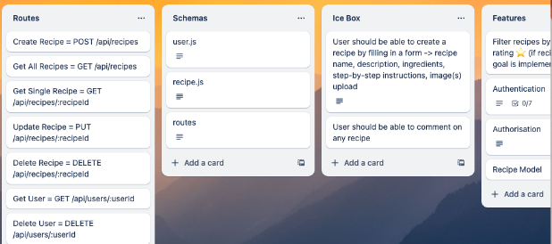
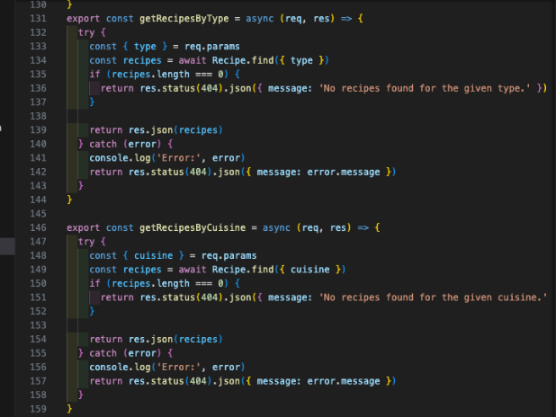
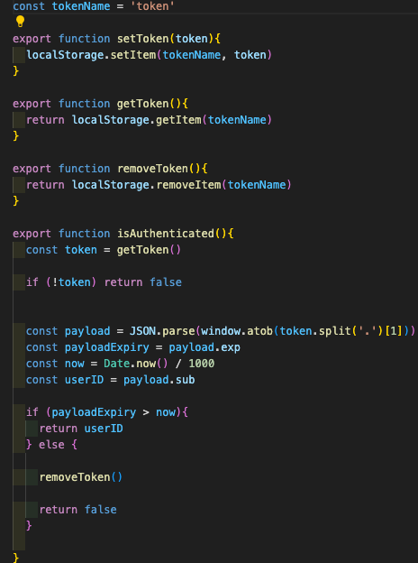
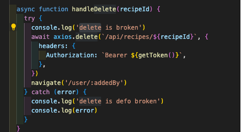

# ReadMe- Project 3 - Flavour Finder

## Description

This was our third project for the General Assembly, Software Engineering Immersive. It was a group project (3 of us) and we had 10 days to complete it. 

You can find ‘Flavour Finder’ on Heroku, here: https://flavourfinder-b2585a80ca2e.herokuapp.com/

You can also find the code on my GitHub page: https://github.com/jillbmh/flavour-finder.git

## Technologies Used

I used the following technologies:

* JavaScript
* Mongoose
* MongoDB
* Express API
* HTML
* CSS
* SASS
* React
* Bootstrap
* Insomnia

We were given the following brief:

## The Idea

We decided to create a recipe sharing website where users could add their own recipes. We wanted users to be able to filter by type of cuisine and meal type.

## Getting Started

We started by meeting to plan the project. We had a shared trello board and we planned what features were needed, what our stretch goals were and what we wanted the user experience to be. We researched and shared colour schemes and planned our wireframes.

## Build/Code Process

We knew we all wanted to work on back end, front end and styling so each day we chose tasks we wanted to work on and then stayed on hand to help each other and jump on zoom if we needed to check something or work together for a part of it. We worked really well together as a team, I really enjoyed it.  

Division of tasks: Luke really wanted to do the account modal and pagination. Kisalie really wanted to do the create component and a carousel on the front page. I really wanted to create the different end points in the back end, work on authorisation and incorporate blogs. 

Early on we realised that the way we divided the back end up didnt quite work, we were working separately on tasks that were really interlinked and testing them as we coded was challenging as each thing relied upon what someone else was doing. We adapted well though and kept committing often and jumping on zoom. 

I did most of the seed data, the blog and recipe models, getRecipeByType and GetRecipeByCuisine functions. I wanted to make the back end do the filtering to reduce the amount of data being pulled through to the client side.

I also did the blogs controller and some of the routes. 

Once we moved onto the front end I did the authorisation functionality. I wanted to make sure all the authorisation was done and could be used in any component:

I did the following components: all blogs, single blog, home page featured (and starter filter), get all recipes (phase 1), the delete recipes function, the profile page and then went over the pages and added a loading spinner. 

We all worked on styling jointly. I did everything to do with the blogs.

## Challenges & Wins

The biggest challenge for me was putting our learning into practice in a way that we all understood. We found that we duplicated a lot of work, I did filters in the back end and my team also did them in the front end. I did authorisation functions to get, set, remove tokens as well as check if someone is authenticated, 1 member of the team used state to pass the authorisation token from component to component and the other team member passed the token to the header so it could be drawn upon at every page. This meant we were all duplicating the same functionality in a different way. 

Overall it was such a win working as a team, it was great to work together and help each other out. I really learnt a lot from them by seeing how they worked and tackled challenges.

## Key Learnings

The key learning for me was that when working as a group, its helpful to talk about the functionality you're dealing with rather than just the component. I think this would have reduced duplication and increased efficiency. This could be achieved by writing really clear pseudocode as a team before you go and work separately.

## Bugs

Create is a PUT request rather than PATCH so all aspects need updating
The upload image on the create recipe page wasn't working once deployed (but was on local host)
The delete icon is within the Link for the image of the recipe so it's hard to delete without just redirecting to the single recipe page.

## Future Improvements

The following future improvements would really enhance the site:
* The search functionality
* Extra seed data
* Recipe reviews and ratings
* Spice level filters
* Add in flags for allergies and dietary requirements
* Ability to follow other users
* Profile update to have username, profile photo, who you're following, favourite recipes
* Comments on recipes
